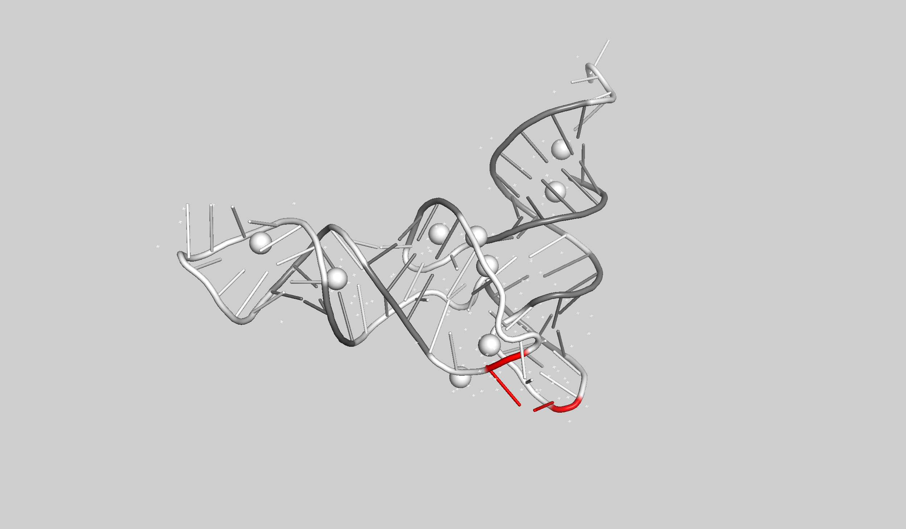
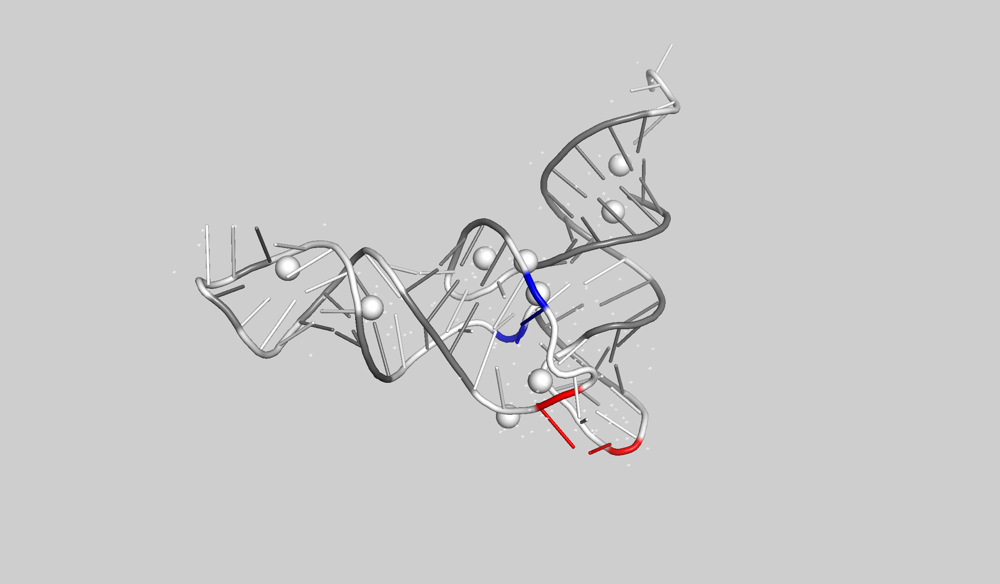

# PseudoknotVisualizer
PseudoknotVisualizer is a **PyMOL Extension** for visualization that assigns **different colors to each Pseudoknot layer**.


# Overview
This tool helps you visually inspect the RNA tertiary structures with pseudoknots.
This is essential for prediction of tertiary structures and selecting the best structure from the structure ensemble.

By default, PseudoknotVisualizer uses canonical base pairs only (Watson–Crick AU/GC + GU wobble). You can optionally include non-canonical base pairs via the new include_all option (see usage below).

PseudoknotVisualizer is available at PyMOL, meaning that it is easy to install.
This tool has two modes of use: CLI and GUI (using PyMOL).

# Demo


- Left: Before coloring pseudoknots.
- Right: After coloring
 - red: pseudoknot layer 1
 - blue: pseudoknot layer 2
 - green: pseudoknot layer 3

# How to Install
## Quickstart (single conda env for both GUI & CLI)
```
# 1) Create env and install PyMOL (open-source build)
conda create -n pkv python=3.11 -y
conda activate pkv
conda install -c conda-forge pymol-open-source -y

# 2) Clone repo + Python deps
cd ~ # optional but recommended for shorter paths (helps RNAView)
git clone https://github.com/TakumiOtagaki/PseudoknotVisualizer.git
cd PseudoknotVisualizer
pip install -r requirements.txt
# (Optional) Option B: DSSR — download binary to DSSR/x3dna-dssr (see below)

# 3) Install an annotator
# Option A: RNAView (build from source). If you want to use existing installation, see below.
git clone https://github.com/rcsb/RNAView.git
cd RNAView
make # if the name of the installation directory is long, you need to modify the RNAView script as shown in the issue.
ls bin # the binary rnaview will be found.
cd .. # back to PseudoknotVisualizer

# 4) Load the PyMOL extension automatically
cp pymolrc_template.py ~/.pymolrc_pkv.py

# 5) Launch PyMOL from the same env
conda activate pkv
pymol
```

After this step, you can use the PyMOL extension as described below at the PyMOL command line:
```
fetch 1ehz
pkv 1ehz
pkv 1ehz, include_all=1
```

If you prefer DSSR for annotation, install it and set `annotator=DSSR` (see below).

You can also use the CLI as described below:
```.sh
# cd PseudoknotVisualizer
python CLI_PseudoknotVisualizer.py \
  -i test/1KPD.pdb \
  -o test/coloring_1KPD.0.A.pymol.txt \
  -c A \
  -f pymol \
  --annotator RNAView
```


## Installation of PseudoknotVisualizer
### Installation overview
1. Clone this repository.
2. Installation of RNAView or DSSR
3. Rewrite or create `~/.pymolrc.py` in order to load the extension at startup automatically.

-----

### 1. Cloning PseudoknotVisualizer

If you followed Quickstart, you have already cloned the repo and changed into it. Otherwise:
```sh
cd ~  # optional but recommended for shorter paths (helps RNAView)
git clone https://github.com/TakumiOtagaki/PseudoknotVisualizer.git
cd PseudoknotVisualizer
```

### 2. Installation of RNAView or DSSR
#### Installation of RNAView
  
You need to install [RNAView](https://github.com/rcsb/RNAView).
Note: RNAView may have installation issues on very long path names. See Troubleshooting below.


If you are installing PseudoknotVisualizer in your home directory (**recommended**), the installation command is simple!
The installation steps are basically as followings:
```sh
git clone https://github.com/rcsb/RNAView.git
cd RNAView
make # if the name of the installation directory is long, you need to modify the RNAView script as shown in the issue.
ls bin # the binary rnaview will be found.
cd ..
```

##### Binary location and config.py (RNAView)
If you already have RNAView installed elsewhere, or you prefer not to compile it inside this repository, point this tool to your installation by editing `config.py`:

```python
# config.py (snippet)
from pathlib import Path

# ---------------- RNAView configuration ----------------
# - RNAVIEW_DIR: Directory that contains the RNAView installation.
#   If you installed RNAView elsewhere, set it like: RNAVIEW_DIR = Path("/opt/RNAView")
RNAVIEW_DIR = PseudoKnotVisualizer_DIR / "RNAView"

# - RNAVIEW_EXEC: Path to the RNAView binary.
#   Example (custom path): RNAVIEW_EXEC = Path("/opt/RNAView/bin/rnaview")
RNAVIEW_EXEC = RNAVIEW_DIR / "bin/rnaview"
# -------------------------------------------------------
```

At runtime, if the binary is not found, the plugin will suggest either placing the `rnaview` binary at `RNAView/bin/rnaview` in this repo, or editing `config.py` to set `RNAVIEW_EXEC` (and `RNAVIEW_DIR`) to your installed path. On macOS/Linux, ensure the binary is executable:
```
chmod +x /path/to/rnaview
```

#### Installation of DSSR
Obtain the DSSR binary as follows:
- Create an account and log in to the [download page](http://forum.x3dna.org/index.php?topic=248.0).
- Choose the correct build for your OS (macOS, Linux, or Windows).
- Download the binary and place it under `DSSR/` in this repository, or set `DSSR_EXEC` in `config.py` to your installed path (see below).

The version we used is `v1.9.10-2020apr23`.  We recommend you to use the same version.

##### Binary location and config.py (DSSR)
Place the downloaded binary as `DSSR/x3dna-dssr` in this repository, or configure `config.py` to point to your installation:

```python
# config.py (snippet)
from pathlib import Path

# ----------------- DSSR configuration ------------------
# - DSSR_EXEC: Path to the x3dna-dssr binary. By default we expect it under this repo's DSSR/ folder.
#   Example (custom path): DSSR_EXEC = Path("/usr/local/bin/x3dna-dssr")
DSSR_EXEC = PseudoKnotVisualizer_DIR / "DSSR" / "x3dna-dssr"
# -------------------------------------------------------
```

On macOS, if you see permission or quarantine warnings:
```
chmod +x /path/to/x3dna-dssr
```
Then allow the binary under System Settings > Privacy & Security when prompted.

### 3. Rewrite or create `~/.pymolrc_pkv.py`
To load the extension at startup automatically, copy the provided template and adjust the path if needed.

```sh
# Copy the template (~/.pymolrc.py)
cp pymolrc_template.py ~/.pymolrc_pkv.py

# If your clone is not under ~/PseudoknotVisualizer, edit pathtoPKV inside ~/.pymolrc_pkv.py accordingly.
```

After this step, the PseudoknotVisualizer extension will be automatically loaded when PyMOL starts.

Now start PyMOL from the same pkv environment:
```sh
conda activate pkv
pymol
```

The PseudoknotVisualizer extension will be loaded automatically at startup.


# How to use
## Basic Usage
After loading models, it can be called and used as follows:
```
# PyMOL command line after loading model
pkv $object (,$chainID)
```
 - object = a model, it can be multimer.
 - chainID = A, B, C, ...

For example, if you want to visualize the pseudoknots in 1kpd in PDB, run the followings:
```
# loading
fetch 1kpd
# at PyMOL command line.
pkv 1kpd
# OR
pkv sele  # if 1kpd is selected.
# You can also choose the annotator explicitly (e.g., DSSR):
pkv 1kpd, annotator=DSSR
```
As you can see from this example, you can use "sele" to identify the model.

### Include non-canonical pairs (PyMOL)
- Default is canonical only (Watson–Crick + GU wobble):
  - `pkv 1kpd` or `pkv 1kpd, include_all=0`
- Include all base pairs (canonical + non-canonical):
  - `pkv 1kpd, include_all=1`
  - `include_all=true|false|yes|no|on|off|1|0` can be used.


### Effect of include_all (DSSR, 1EHZ)
Below is a concrete example showing how include_all changes the detected pseudoknot layers.



- Left: canonical only (annotator=DSSR)
- Right: include_all (annotator=DSSR)
- Including non-canonical pairs increases the pseudoknot order (number of layers).


Also you can get the details in the PyMOL command line using `help pkv`:
```sh
pymol commandline$ help pkv
PseudoKnotVisualizer: Visualize pseudoknot layers in RNA structures.
Usage: pkv object [,chain] [,annotator] [,auto_renumber] [,only_pure_rna] [,skip_precoloring] [,selection] [,include_all]
 - **object** (str): Structure object name loaded in PyMOL.
 - **chain** (str): Chain ID. If omitted, all chains are analyzed.
 - **annotator** (str): Base-pair annotator: "RNAView" or "DSSR". Default: RNAView.
 - skip_precoloring (bool): If True, do not pre-color the chain white. Default: False.
 - selection (bool): If True, create selections per layer like <obj>_c<chain>_l<depth>. Default: True.
    - Additionally, paper-friendly names are created: `core` (layer 1), `pk1` (layer 2), `pk2` (layer 3), ...
 - auto_renumber (bool): If True, renumber residues to start from 1 when necessary (mainly for RNAView). Default: True.
  - include_all (bool): If True, include all base pairs (canonical + non-canonical). Default: False (canonical only).
```

## Changing Colors (Optional)
If you want to change the color of each layer, modify PseudoknotVisualizer/colors.json. You can also add new lines.

Make sure to update colors.json before launching PyMOL.

```colors.json
{
    "1": "gray",
    "2": "red",
    "3": "blue",
    "4": "green",
    "5": "yellow",
    "6": "purple",
    "default": "gray"
}
```
If the number of layers (pseudoknot order) is greater than 6, PseudoknotVisualizer will color the 7th and subsequent layers with a default color.

To increase this limit beyond 6, simply add entries like "7": "another color".

If PyMOL is already running when you change `colors.json`, restart PyMOL.

# For CLI users
You can use the CLI without configuring `~/.pymolrc.py`. Use the same `pkv` environment created in Quickstart.

## CLI Usage
```sh
$ python PseudoknotVisualizer/CLI_PseudoknotVisualizer.py --help

usage: CLI_PseudoknotVisualizer.py [-h] -i INPUT -o OUTPUT -f {chimera,pymol} [-m MODEL] [-c CHAIN] [-a {DSSR,RNAView}] [--include-all]

Visualize pseudoknots in RNA structure

options:
  -h, --help            show this help message and exit
  -i INPUT, --input INPUT
                        Input file containing RNA structure (.pdb or .cif)
  -o OUTPUT, --output OUTPUT
                        Output script file for visualization
  -f {chimera,pymol}, --format {chimera,pymol}
                        Output script format (chimera or pymol)
  -c CHAIN, --chain CHAIN
                        Chain ID (default: A)
  -a {DSSR,RNAView}, --annotator {DSSR,RNAView}
                        Base-pair annotator (default: RNAView)
  --include-all         Include all base pairs (canonical + non-canonical). Default: canonical only

chimera options:
  Options specific to Chimera format
  -m MODEL, --model MODEL
                        Model ID (required if Chimera format is selected)
```

Also you can fetch PDB file from Protein Data Bank.
```sh
$ python fetch_pdb.py
Enter PDB ID (q to quit): 1kpd
Enter output filename(if not provided, pdb_id.pdb will be created in current directory): 
PDB file for 1kpd downloaded as ./1kpd.pdb
```
Then, 1kpd.pdb is downloaded in current directory.

## CLI (use the same `pkv` environment)
Reuse the environment created in **Quickstart** (do not create another env).
1) Activate:
```sh
conda activate pkv
```
2) Ensure deps are installed (already done in Quickstart):
```sh
pip install -r requirements.txt
```
3) Install and configure one annotator (RNAView or DSSR) as above.
4) Run:
```sh
python PseudoknotVisualizer/CLI_PseudoknotVisualizer.py \
  -i test/1kpd.cif -o out.txt -f pymol -c A --annotator RNAView
```

Include all base pairs (CLI):
```sh
python PseudoknotVisualizer/CLI_PseudoknotVisualizer.py \
  -i test/1kpd.cif -o out_all.txt -f pymol -c A --annotator RNAView \
  --include-all
```

Notes (CLI, PyMOL format):
- The generated script starts by whitening the target chain: `color white, <object> and chain <chain>`
- It also creates selections per layer with paper-friendly names: `core`, `pk1`, `pk2`, ...

Notes (CLI, Chimera format):
- The script starts by whitening the target chain: `color white #<model_id>:.<chain>`


## Example of CLI usage
```sh
conda activate pkv
python PseudoknotVisualizer/CLI_PseudoknotVisualizer.py \
  -i test/1KPD.pdb \
  -o test/coloring_1KPD.0.A.pymol.txt \
  -c A \
  -f pymol \
  --annotator RNAView
  # -m 0  # model ID if you choose Chimera format (-f chimera)

# Use DSSR annotator example
python PseudoknotVisualizer/CLI_PseudoknotVisualizer.py \
  -i test/1KPD.pdb \
  -o test/coloring_1KPD.0.A.pymol.dssr.txt \
  -c A \
  -f pymol \
  --annotator DSSR
```


# Errors caused by PDB numbering mismatch 
## Case 1
PseudoknotVisualizer cannot color the specified molecule accurately when the residue numbering in PyMOL does not start at 1.
If so, please check the sequence index (`your_start_index`) pushing "S" button and do as followings:
```sh
select rna_chain, your_pdb_id and chain your_chain_id
alter rna_chain, resi = int(resi) - (your_start_index - 1)
pkv your_pdb_id
```
Here, please rewrite 
 - your_pdb_id
 - your_chain_id
 - your_start_index.

Then, it will work.

### Update
Now, PseudoKnotVisualizer can deal the molecule whose sequence index in PyMOL does not start with 1.
In the PyMOL command line, you can specify the `auto_renumber` flag (default: True):
```
$ help pkv
...
 - auto_renumber(bool): If True, automatically renumber residues from 1,
    to avoid the error caused by non-sequential residue numbers in the input PDB file.
```

Using this option, you can avoid the error around the non-ordinary sequence index.

- 2025-05-30: Fixed an issue where some RNAView-detected pairs (e.g., 1ehz) were not colored.
- 2025-07-16: Initial DSSR support in progress.
- 2025-09-01: Added include_all option (default is canonical-only; pass include_all/--include-all to include non-canonical).

## Troubleshooting
### RNAView path-length crash
When installing/using RNAView in a directory with a very long path (e.g., > ~60 chars), RNAView may crash due to a buffer size issue. See:
[Buffer Overflow in get_reference_pdb() Caused by Insufficient Buffer Size](https://github.com/rcsb/RNAView/issues/11)

Workarounds:
- Place this repository (and/or RNAView) under a shorter path (e.g., your home directory), or
- Patch RNAView source as described in the issue, then rebuild.

### "RNAView binary not found" / "DSSR binary not found"
The plugin checks for the binaries before running. If not found:
- Place the binaries at the default locations in this repository:
  - RNAView: `RNAView/bin/rnaview`
  - DSSR   : `DSSR/x3dna-dssr`
- Or edit `config.py` and set:
  - `RNAVIEW_DIR` and `RNAVIEW_EXEC` for RNAView
  - `DSSR_EXEC` for DSSR

### Permission denied or quarantine on macOS
```
chmod +x /path/to/rnaview
chmod +x /path/to/x3dna-dssr
xattr -d com.apple.quarantine /path/to/x3dna-dssr  # if needed
```
Then allow execution under System Settings > Privacy & Security.

### "No module named 'pymol'" (for the PyMOL extension)
Install PyMOL from conda-forge inside your conda environment:
```
conda install -c conda-forge pymol-open-source
```

### RNAView output not produced or empty
- Ensure the input selection is a valid RNA chain in PyMOL and exported as PDB when using RNAView.
- If residue numbering does not start at 1, prefer `annotator=DSSR` or keep `auto_renumber=True` for RNAView.
  - You can avoid this error by using DSSR.

# License
This software is released under the MIT License.  
See [LICENSE](./LICENSE) for details.
