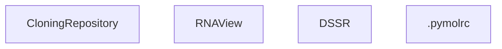

# PseudoknotVisualizer
PseudoknotVisualizer is a **PyMOL Extension** for visualization that assigns **different colors to each Pseudoknot layer**.


# Overview
This tool enables us to visually understand the RNA tertiary structures with pseudoknots.
This is essential for prediction of tertiary structures and selecting the best structure from the structure ensemble.

For now, PseudoknotVisualizer treats only canonical base pairs(AU, GU, GC), however non-canonical pairs can be included or re-labeled in future updates.

PseudoknotVisualizer is available at PyMOL, meaning that it is easy to install.
This tool has two modes of use: CLI and GUI (using PyMOL).

# Demo


- Left: Before coloring pseudoknots.
- Right: After coloring
 - red: pseudoknot order 1
 - blue: pseudoknot order 2
 - green: pseudoknot order 3
 - (gray: Main Layer)


# How to Install
## Prepairing "pymol" Conda Environment. (Recommended)
```
conda create -n pymol python=3.11.0
conda activate pymol
conda install pandas numpy
conda install -c conda-forge pymol-open-source
pymol # pymol will get started.
```
Type `pymol` in conda pymol env, then open source PyMOL app will start.


## Installation of PseudoknotVisualizer
### overview of the installation
1. Clone this repository.
2. Installation of RNAView
3. Rewrite or create `~/.pymolrc.py` in order to load the extension at startup automatically.




-----

### 1. Cloning PseudoknotVisualizer

Cloning in home directory is recommended due to the error of submodule RNAView.
```sh
cd ~ # if you do not want to install this tool in home directory, please skip this line.
git clone https://github.com/TakumiOtagaki/PseudoknotVisualizer.git
cd PseudoknotVisualizer
```

### 2. Installation of RNAView
  
You need to install [RNAView](https://github.com/rcsb/RNAView).
There is an error around the installation of RNAView,


If you are installing PseudknotVisualizer in your home directory (recommended), the installation command is simple!
The installation steps are basically as followings:
```sh
git clone https://github.com/rcsb/RNAView.git
cd RNAView
make # if the name of the installation directory is long, you need to modify the RNAView script as shown in the issue.
ls bin # the binary rnaview will be found.
cd ..
```


### 3. Rewrite or create `~/.pymolrc.py`
To  load the extension at startup automatically, please follow the instructions below.

```sh
$ vim ~/.pymolrc.py
```
And modify the pathtoPKV line:
Please do not use the "~" character.
```~/.pymolrc.py
# ~/.pymolrc.py
import sys
import pathlib
from pymol import cmd

# --------------------- please modify this line: the path of PseudoknotVisualizer repository -------------------------
pathtoPKV = pathlib.Path("/path/to/PseudoknotVisualizer") # <-- Please modify this line! This is the path of this repository.
# --------------------------------------------------------------------------------------------------------------------

sys.path.append(str(pathtoPKV))
cmd.run( str(pathtoPKV /  "PseudoknotVisualizer.py"))
```


Now, you can use our extension easily.
After this step, the PseudoknotVisualizer extention will be automatically loaded when PyMOL starts.

## Error cased by RNAView installation
When you are installing PseudknotVisualizer in a directory with a long path (longer than 60 char),
you need to edit the line46 in RNAView/src/fpair_subs.c. 
Please read the issues: [Buffer Overflow in get_reference_pdb() Caused by Insufficient Buffer Size ](https://github.com/rcsb/RNAView/issues/11)

To avoid this error, we recommend that you should install PseudoknotVisualizer in your home directory.


# How to use
## Basic Usage
After loading models, it can be called and used as follows:
```
# PyMOL command line after loading model
pkv $pdb_object (,$chainID)
```
 - pdb_object = a model, it can be multimer.
 - chainID = A, B, C, ...

For example, if you want to visualize the pseudoknots in 1kpd in PDB, run the followings:
```
# loading
fetch 1kpd
# at PyMOL command line.
pkv 1kpd
# OR
pkv sele  # if 1kpd is selected.
```
As you can see from this example, you can use "sele" to identify the model.


Also you can get the detail explanation in pymol command line using `help pkv`:
```sh
pymol commandline$ help pkv
PseudoKnotVisualizer: Visualizing Pseudo Knots in RNA structure.
Usage: pkv pdb_object [,chain_id]
 - pdb_object(str): PDB object name
 - chain_id(str) : Chain ID of the RNA structure.
    If not specified, all chains will be analyzed.
 - auto_renumber(bool) [auto_renumber: True]: If True, automatically renumber residues from 1,
    to avoid the error caused by non-sequential residue numbers in the input PDB file.
 - only_pure_rna(bool) [default: False]: If True, only standard RNA bases (A, C, G, U, I) are analyzed.
 - non_precoloring(bool) [default: False]: If True, all atoms are not colored 'white' before coloring the base pairs.
```

## Changing Colors (Optinal)
If you want to change the color of each layer, modify PseudoknotVisualizer/colors.json. You can also add new lines.

Make sure to update colors.json before launching PyMOL.

```colors.json
{
    "1": "gray",
    "2": "red",
    "3": "blue",
    "4": "green",
    "5": "yellow",
    "6": "purple",
    "default": "gray"
}
```
If the number of layers (pseudoknot order) is greater than 6, PseudoknotVisualizer will color the 7th and subsequent layers with a default color.

To increase this limit beyond 6, simply add entries like "7": "another color".

# For CLI user
After the installation (except for step 4), you can use our CLI.

## CLI Usage
```sh
$ python 'PseudoknotVisualizer/CLI_PseudoknotVisualizer.py' --help

usage: CLI_PseudoknotVisualizer.py [-h] -i INPUT -o OUTPUT -f {chimera,pymol} [-m MODEL] [-c CHAIN]

Visualize pseudoknots in RNA structure

options:
  -h, --help            show this help message and exit
  -i INPUT, --input INPUT
                        Input file containing RNA structure
  -o OUTPUT, --output OUTPUT
                        Output script file for visualization
  -f {chimera,pymol}, --format {chimera,pymol}
                        Format of RNA structure (chimera or pymol)
  -c CHAIN, --chain CHAIN
                        Chain ID for RNA structure, default is A

chimera options:
  Options specific to Chimera format

  -m MODEL, --model MODEL
                        Model ID (required if Chimera format is selected)
```

Also you can fetch PDB file from Protein Data Bank.
```sh
$ python fetch_pdb.py
Enter PDB ID (q to quit): 1kpd
Enter output filename(if not provided, pdb_id.pdb will be created in current directory): 
PDB file for 1kpd downloaded as ./1kpd.pdb
```
Then, 1kpd.pdb is downloaded in current directory.

## Installation for CLI user
 1.	Run
    ```sh
   	conda create -n pymol python=3.11
    conda activate pymol
    ```
2.	Run
  ```
  pip install -r requirements.txt
  ```
3.	Complete steps 1 through 3 from the installation instructions above.

4.	Execute the command `python CLI_PseudoknotVisualizer.py -i input.pdb -o ...`


## Example of CLI usage
```sh
conda activate pymol
python PseudoknotVisualizer/CLI_PseudoknotVisualizer.py \
  -i test/1KPD.pdb \  # input pdb file.
  -o test/coloring_1KPD.0.A.pymol.txt \ # path of output script txtfile
  -c A \ # chain ID
  -f pymol \ # format: chimera or pymol
  # -m 0 # model ID in your viewer if you choose chimera format with -f option.
```


# Errors caused by the mismatch of pdb format 
## Case 1
PseudoknotVisualizer can not color accurately the specified molecule when the sequence index in PyMOL viewer does not start with 1.
If so, please check the sequence index (`your_start_index`) pushing "S" button and do as followings:
```sh
select rna_chain, your_pdb_id and chain your_chain_id
alter rna_chain, resi = int(resi) - (your_start_index - 1)
pkv your_pdb_id
```
Here, please rewrite 
 - your_pdb_id
 - your_chain_id
 - your_start_index.

Then, it will work.

### Update
Now, PseudoKnotVisualizer can deal the molecule whose sequence index in PyMOL does not start with 1.
In pymol command line, you can specify the `auto-renumber` flag (default: True):
```
$ help pkv
...
 - auto_renumber(bool): If True, automatically renumber residues from 1,
    to avoid the error caused by non-sequential residue numbers in the input PDB file.
```

Using this option, you can avoid the error around the non-ordinary sequence index.

#### 20250530 update
 - Fixed an issue where, for certain entries (e.g., 1ehz), some base pairs detected by RNAView were not being colored.

#### 20250716 update
 - DSSR に対応中...

# License
This software is released under the MIT License.  
See [LICENSE](./LICENSE) for details.
